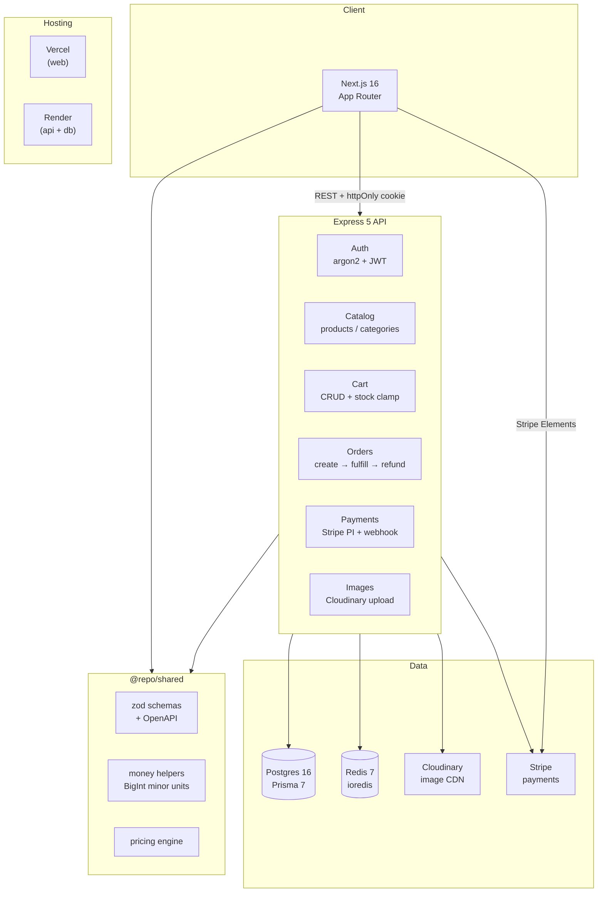

# KartIt

Production-grade ecommerce platform built on a modern TypeScript monorepo. Full-stack checkout flow with Stripe payments, admin product/category/order management, and a hardened Express API.

## Architecture



## Stack

| Layer | Technology |
|-------|-----------|
| Monorepo | npm workspaces |
| Web | Next.js 16 + React 19 + Tailwind v4 |
| API | Express 5 + TypeScript |
| Database | Postgres 16 + Prisma 7 (PG adapter) |
| Cache | Redis 7 + ioredis |
| Auth | argon2id + JWT in httpOnly cookie |
| Payments | Stripe PaymentIntents + signed webhooks |
| Images | Cloudinary server-side upload |
| Validation | Zod v4 + OpenAPI generation |
| Testing | Vitest + Testcontainers |
| CI | GitHub Actions |

## Run locally in 60 seconds

**Prerequisites:** Node.js ≥20.19, Docker Desktop, a Stripe account (free), and a Cloudinary account (free tier).

```bash
# 1. Clone and install
git clone <repo-url> && cd ecomm

# 2. Set up env files
copy .env.example .env
copy apps\api\.env.example apps\api\.env
copy apps\web\.env.example apps\web\.env.local

# 3. Fill in secrets in apps/api/.env:
#    - JWT_SECRET: openssl rand -hex 32
#    - CLOUDINARY_CLOUD_NAME, CLOUDINARY_API_KEY, CLOUDINARY_API_SECRET (from cloudinary.com)
#    - STRIPE_SECRET_KEY (sk_test_... from stripe.com)
#    - STRIPE_WEBHOOK_SECRET (see Stripe CLI section below)

# 4. In apps/web/.env.local:
#    - NEXT_PUBLIC_STRIPE_PUBLISHABLE_KEY (pk_test_...)
#    - NEXT_PUBLIC_CLOUDINARY_CLOUD_NAME

npm install

# 5. Start Postgres + Redis
docker compose up -d

# 6. Run migrations and seed
npm run db:migrate:dev
npm run db:seed

# 7. Start both services
npm run dev
```

API runs on [localhost:5000](http://localhost:5000). Web runs on [localhost:3000](http://localhost:3000).

Seed creates an admin user (`admin@example.com` / `password123`) and sample products with images.

## Stripe testing

### Test card numbers

| Card | Number | CVC | Date |
|------|--------|-----|------|
| Visa (success) | `4242 4242 4242 4242` | Any 3 digits | Any future date |
| Visa (3DS required) | `4000 0025 0000 3155` | Any 3 digits | Any future date |
| Mastercard (declined) | `4000 0000 0000 0002` | Any 3 digits | Any future date |

Full list: [Stripe test cards](https://docs.stripe.com/testing#cards).

### Webhook forwarding (Stripe CLI)

The API's webhook endpoint is at `POST /payments/webhook`. Stripe sends events there, but it needs a public URL. Forward them locally:

```bash
# Install Stripe CLI: https://docs.stripe.com/stripe-cli
stripe login

# Forward events to your local API
stripe listen --forward-to localhost:5000/payments/webhook

# The CLI prints a signing secret — copy it into apps/api/.env as STRIPE_WEBHOOK_SECRET
```

Trigger test events from the CLI in another terminal:

```bash
# Test a successful payment (replace pi_xxx with a real PI from your app)
stripe trigger payment_intent.succeeded

# Test a refund
stripe trigger charge.refunded
```

## API overview

```
GET    /health                 DB + Redis ping
GET    /health/live            Liveness (no deps)
GET    /health/readyz          Readiness (DB + Redis)

POST   /auth/signup            Rate-limited
POST   /auth/signin            Rate-limited
POST   /auth/signout
POST   /auth/sign-out-all      Invalidate all sessions
GET    /auth/me
PATCH  /auth/me                Update profile
POST   /auth/change-password

GET    /addresses              List own
POST   /addresses              Create
PUT    /addresses/:id          Update own
DELETE /addresses/:id          Delete own

GET    /categories             Public
GET    /categories/slug/:slug
POST   /categories             Admin
PUT    /categories/:id         Admin
DELETE /categories/:id         Admin

GET    /products               ?q, ?categoryId, ?cursor, ?limit
GET    /products/slug/:slug
POST   /products               Admin
PUT    /products/:id           Admin
DELETE /products/:id           Admin

POST   /images/upload          Admin (multipart)
DELETE /images                 Admin

GET    /cart
POST   /cart/items
PATCH  /cart/items/:productId
DELETE /cart/items/:productId
DELETE /cart                   Clear

POST   /orders                 Create from cart (idempotent)
GET    /orders                 List own (admin: ?scope=all)
GET    /orders/:id
POST   /orders/:id/cancel
PATCH  /orders/:id/status      Admin
POST   /orders/:id/refund      Admin

POST   /payments/intent        Create Stripe PaymentIntent (idempotent)
POST   /payments/webhook       Stripe signed webhook

GET    /docs.json              OpenAPI spec
GET    /docs                   Swagger UI
```

## Project structure

```
ecomm/
  apps/
    api/                       Express 5 API
      src/
        config/                Validated env loader
        lib/                   Auth, cache (Redis), cloudinary, cookies, errors, jwt, logger, redis, stripe
        middlewares/           Auth, CSRF, error handling, idempotency, validation, upload
        modules/               Feature modules (health, auth, cart, orders, payments, ...)
        jobs/                  Cron scripts (abandoned order sweeper)
      test/                    Vitest + Testcontainers (unit + integration)
    web/                       Next.js 16 App Router
      app/                     Pages (public, auth, admin routes)
      components/              UI components + payment integration
      lib/                     Client utilities
      hooks/                   React hooks (API mutation, idempotency, Stripe)
      services/                API client, checkout orchestration
  packages/
    db/                        Prisma 7 schema, migrations, seed, singleton client
    shared/                    Zod schemas, money helpers, enums, error codes, pricing
  docker-compose.yml           Postgres 16 + Redis 7 + optional build profile for api/web
  render.yaml                  Render Blueprint
```

## Available scripts

```bash
npm run dev              # Start web + api concurrently
npm run dev:api          # API only
npm run dev:web          # Web only

npm run db:migrate:dev   # Create and apply a migration (-- --name <name>)
npm run db:migrate:deploy# Apply pending migrations (production)
npm run db:seed          # Seed the database
npm run db:studio        # Open Prisma Studio

npm run test             # Run all API tests
npm run test:watch       # Watch mode
npm run typecheck        # Type-check both apps

npm run build            # Build everything (packages → api → web)
npm run job:sweep        # Cancel abandoned PENDING orders (>30 min)
```

## Testing

Tests use **Vitest** + **Testcontainers** (spins up a real Postgres 16 container per run). No mocking required.

```bash
# Full suite (unit + integration)
npm run test

# Watch mode
npm run test:watch
```

CI runs lint → typecheck → test → build on every push and PR via GitHub Actions.

## Deployment

**API + Database:** [Render Blueprint](render.yaml) provisions a managed Postgres instance, a Redis instance, and the Express API web service. Apply from the Render dashboard → New → Blueprint.

After first deploy, set these env vars in the `ecomm-api` service:
- `JWT_SECRET` (auto-generated)
- `REDIS_URL` — Render injects this automatically for managed Redis; set manually if using external Redis
- `WEB_ORIGINS` — your Vercel domain(s)
- `CLOUDINARY_*` keys
- `STRIPE_SECRET_KEY` + `STRIPE_WEBHOOK_SECRET`
- `COOKIE_SECURE=true`, `COOKIE_SAMESITE=none`

**Web:** Deploy to Vercel. Set `NEXT_PUBLIC_*` env vars in the Vercel dashboard before the first build — they are inlined into the client bundle at build time.

**Production checklist:**
- [ ] Set up Stripe webhook pointing at `https://<api-domain>/payments/webhook` with events `payment_intent.succeeded`, `payment_intent.payment_failed`, and `charge.refunded`
- [ ] Set up a Render Cron job calling `npm run job:sweep` every 5 minutes to clean up abandoned orders
- [ ] Enable branch protection on `main` requiring CI status checks
